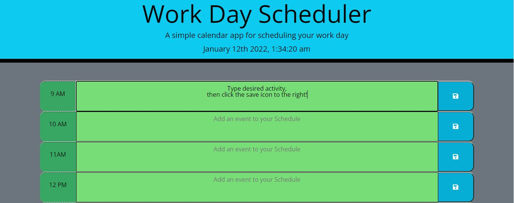

# Workday Scheduler

            
## Link:
https://tschram93.github.io/workday-planner/
## Description: 
A daily work scheduler allowing the user to input their event for the specific time frame and then save the event.

## Instructions: 
Type the desired activity into the area that says "add event to schedule", then click the save icon in the blue field on the line that was typed into.

## Dependencies
The dependency for my app that was used is "n/a"

## Testing
n/a

### License
none was used for licensing.

### Contact Information
* [Github](https://github.com/Tschram93)
* Email:  TSchram93.dev@gmail.com
